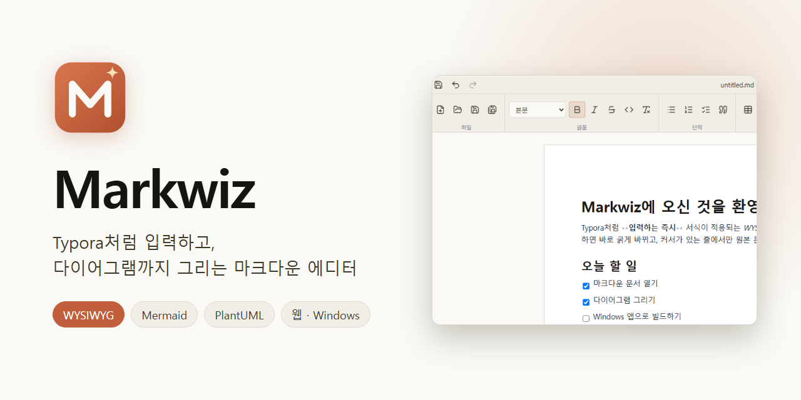
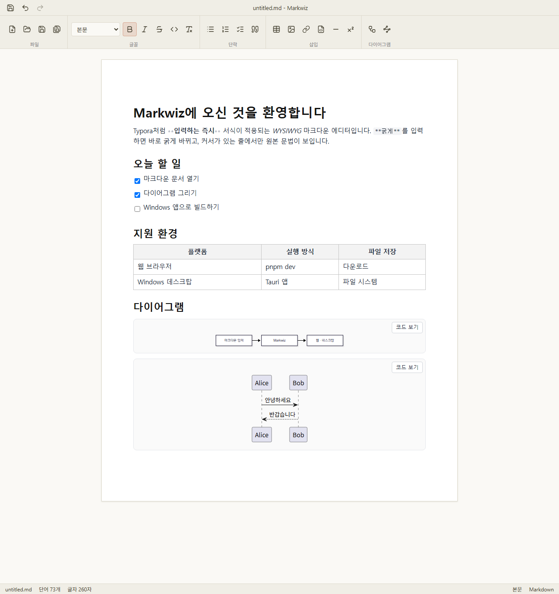

<p align="center">
  
</p>

# Markwiz

*[한국어](README.md) | English*

A Typora-style WYSIWYG Markdown editor built on Tiptap (ProseMirror). It renders Mermaid and
PlantUML diagrams entirely client-side, with no backend server required. Web and desktop (Tauri)
share the same codebase.

**Current version: 0.1.2** (2026-09-24). See the [release notes](#release-notes) for what changed.



## Key features

- **Real-time WYSIWYG editing** — Markdown syntax (`# `, `**bold**`, `- `, `> `, ` ``` `, `[]()`, etc.)
  turns into formatting the moment you type it, and the raw syntax is shown only on the line the
  cursor is on (Typora-style).
- **Diagrams** — ` ```mermaid ` and ` ```plantuml ` code blocks render as diagrams. No backend
  server needed.
- **Export to PDF / Word** — both printing (PDF) and generating a real `.docx` (Word) happen in the
  browser/webview, with no server involved.
- **Typora-identical shortcuts** — `keymap.json` maps Windows/Linux and macOS separately and can be
  edited directly to remap keys.
- **Word-style ribbon toolbar + status bar** — formatting/insert buttons, word/character counts,
  current block type.
- **Lossless round-trip** — opening and saving Markdown keeps the file byte-for-byte identical
  (verified by round-trip tests).
- **Web + desktop** — only file open/save differ by platform (web: file picker/download, desktop:
  real filesystem); the UI is 100% shared.

Supported syntax: headings (H1–H6), bold/italic/strikethrough/inline code, blockquotes,
ordered/unordered lists, checkboxes, code blocks (syntax highlighting), tables (GFM), links,
images, horizontal rules, footnotes.

## Installation

### Install from a release build (Windows)

Grab the latest installer from the [Releases page](https://github.com/objectworld/markwiz/releases).

| File | Description |
|---|---|
| `Markwiz_0.1.2_x64-setup.exe` | Installer (recommended; installs WebView2 automatically if missing) |
| `Markwiz_0.1.2_x64_en-US.msi` | MSI package |
| `markwiz.exe` | Standalone executable, no installation (requires WebView2 runtime) |

The app isn't code-signed, so Windows SmartScreen may warn on first launch ("More info → Run
anyway"). To build from source, follow the steps below.

### 1. Required software

Running the web version only requires **Node.js** and **pnpm**. Building the desktop app also
needs the Rust toolchain and platform-specific tools.

| Software | Purpose | Notes |
|---|---|---|
| [Node.js](https://nodejs.org) 22 LTS or later | Dev server, build | Developed with v22.19 |
| [pnpm](https://pnpm.io) | Package manager | Pinned for this project |
| [Rust](https://rustup.rs) 1.77.2 or later | Desktop build | Install via `rustup` |
| C++ build tools | Desktop build | Windows: Visual Studio Build Tools |
| WebView2 runtime | Running the desktop app | Included by default on Windows 11 |

#### Windows (PowerShell)

```powershell
# Node.js LTS, pnpm
winget install OpenJS.NodeJS.LTS
npm install -g pnpm

# Only needed to build the desktop app: Rust + C++ build tools
winget install Rustlang.Rustup
winget install Microsoft.VisualStudio.2022.BuildTools --override "--quiet --wait --norestart --add Microsoft.VisualStudio.Workload.VCTools --includeRecommended"
```

Open a new terminal afterward and confirm `node -v`, `pnpm -v`, and `rustc --version` all print a
version. Build Tools is large (several GB) and can take a while.

#### macOS / Linux

Follow Tauri's official [prerequisites](https://v2.tauri.app/start/prerequisites/) (Xcode Command
Line Tools on macOS, system libraries such as `webkit2gtk` on Linux).
Development and testing have only been done **on Windows**; macOS/Linux builds have not been
verified yet.

### 2. Get the source and install dependencies

```bash
git clone https://github.com/objectworld/markwiz.git
cd markwiz
pnpm install
```

## Running and building

### Development mode

```bash
pnpm dev          # web dev server — http://localhost:5173
pnpm tauri dev    # desktop app dev mode (requires Rust)
```

### Web build

```bash
pnpm build        # output: dist/ (static files)
pnpm preview      # preview the build locally — http://localhost:4173
```

`dist/` can be deployed as-is to static hosting (Nginx, GitHub Pages, etc.). The built
`index.html` includes a CSP `<meta>` tag allowing `'wasm-unsafe-eval'` so PlantUML (WebAssembly)
works. If your server sets its own CSP header, it must allow the same policy (see `csp.ts`).

### Desktop app build (Windows)

```bash
pnpm tauri build
```

Artifacts are written to `src-tauri/target/release/`.

| File | Description |
|---|---|
| `bundle/nsis/Markwiz_0.1.2_x64-setup.exe` | Installer (recommended; installs WebView2 automatically if missing) |
| `bundle/msi/Markwiz_0.1.2_x64_en-US.msi` | MSI package |
| `markwiz.exe` | Standalone executable, no installation |

- Running the exe alone (without an installer) requires the **WebView2 runtime** on the target PC.
- The app isn't code-signed, so Windows SmartScreen may warn on first launch ("More info → Run
  anyway").
- The build fails to overwrite `markwiz.exe` if it's currently running at the build location. Quit
  the app before building.
- To check that the app compiles without producing installers, use `pnpm tauri build --no-bundle`.

### Tests

```bash
pnpm test         # run the full Vitest suite
pnpm test:watch   # watch mode
```

### Replacing the icon

The originals are `docs/images/logo.svg` (vector) and `logo.png` (1024px). To use a different
image, prepare a 1024×1024 PNG and run:

```bash
pnpm tauri icon path/to/icon.png
```

This regenerates the `.ico`/`.icns` and per-size PNGs under `src-tauri/icons/`. It also creates
`android/` and `ios/` folders for mobile targets, which you can delete since this project doesn't
support mobile. The web favicon is `public/favicon.svg`.

## Usage

### Screen layout

| Area | Description |
|---|---|
| Window title | Current document name (`document.md - Markwiz`) |
| Menu bar (desktop) | File / Edit / Font / Paragraph / Insert / Diagram / View / Help. Mirrors the toolbar, with shortcuts shown alongside each item. Export lives in the **File > Export** submenu |
| Toolbar | File / Edit (undo·redo) / Font / Paragraph / Insert / Diagram / Export / View groups. Hover a button to see its name and shortcut |
| Sidebar | Document outline (heading list). Open by default; toggle with `Ctrl+Shift+L` |
| Document area | An ivory-colored workspace with a single sheet of white paper. Clicking empty space still starts editing |
| Status bar | Document name, word count, character count (excluding spaces), selected character count, current block type |

- **Font group**: style dropdown (body text, heading 1–6), bold, italic, strikethrough, inline
  code, clear formatting
- **Insert group**: table, image, link, code block, horizontal rule, footnote
- Formatting applied at the cursor position is shown as a highlighted button.

### Typing Markdown directly

Typing the patterns below converts them to formatting immediately. The line the cursor is on shows
the raw syntax (`#`, `**`, etc.) dimmed alongside the rendered text.

| Input | Result |
|---|---|
| `# ` through `###### ` + space | Heading 1–6 |
| `**bold**` | **bold** |
| `*italic*` or `_italic_` | *italic* |
| `~~strikethrough~~` | ~~strikethrough~~ |
| `` `code` `` | inline code |
| `> ` + space | blockquote |
| `- `, `* `, `+ ` + space | bulleted list |
| `1. ` + space | numbered list |
| `[ ] `, `[x] ` (start of line) | checkbox |
| ` ```language ` + space (e.g. ` ```js `) | code block (syntax highlighting) |
| `---` | horizontal rule |
| `[text](url)` | link |
| `` | image |

### Inserting links and images

Clicking the link/image buttons in the toolbar's **Insert** group (or pressing `Ctrl+K`,
`Ctrl+Shift+I`) opens an insert dialog.

- **Web address**: type `https://example.com`. Leaving off `https://` (e.g. `example.com`) adds it
  automatically.
- **A file on your computer** (desktop app): use the **Choose file…** button, or type a path
  directly, e.g. `C:\Users\me\a.png`. The image is shown immediately. The address that gets stored
  depends on where the file is:
  - A file **in the document's folder or a subfolder** → a relative path (`./img/a.png`). The link
    keeps working if you move the document and the file together.
  - A file anywhere else (a parent folder, a different drive, etc.), or a document that hasn't been
    saved yet → an absolute path (`file:///C:/Users/me/a.png`).
  Links apply to the selected text if there is a selection; otherwise you're asked for **display
  text**.
- Clearing the address field and confirming removes the link.
- In the web version, only image files (1MB or smaller) can be chosen, and they're embedded as data
  in the document. Links can't point to local files on the web.

Tables and footnotes are inserted from the toolbar's **Insert** button (or `Ctrl+T` for a table).
Opening a Markdown file that already contains `|` tables or `[^1]` footnotes reads them as tables
and footnotes as-is.

### Opening and saving files

| Action | Shortcut (Windows/Linux) | Description |
|---|---|---|
| New | `Ctrl+N` | Blank document |
| Open | `Ctrl+O` | `.md` / `.markdown` file |
| Save | `Ctrl+S` | Overwrites the open file, or falls back to "Save As" if none is open |
| Save As | `Ctrl+Shift+S` | |

- **Desktop app**: uses the OS's file open/save dialogs and writes to the real file. The same
  actions are also available from the top menu (File, etc.).
- **Web browser**: opening shows a file picker, and saving triggers a browser download (browsers
  can't overwrite a local file directly).

#### Opening `.md` files by double-clicking

Both the NSIS and MSI installers show a checkbox during installation asking **whether to open
`.md`/`.markdown` files with Markwiz** (checked by default). Installing with it checked lets you
double-click a file in Explorer, or choose "Open with → Markwiz", to open it.

- If Markwiz is already open, it opens the file in the existing window instead of a new one (and
  brings that window to the front).
- Doesn't apply if you just copy the standalone `markwiz.exe` without using an installer.
- Unattended installs (NSIS's `/P` flag, MSI's `/qn`/`/qb`) don't show the checkbox and associate
  the file type by default, as in earlier versions.
- Verified on Windows only. The setting exists for macOS/Linux too but hasn't been verified there.

#### Recently opened files

**File > Recently Opened Files** in the desktop app lets you quickly reopen a recent file.

- Remembers up to **10** files, most recent first. Reopening a file already in the list moves it to
  the top instead of duplicating it.
- Files opened via **Open**, and files saved via **Save As** (or a first save), are recorded. The
  list survives restarting the app.
- Each entry shows its containing folder dimmed on the right; hover to see the full path.
- If a file has been moved or deleted, it's dropped from the list and a notice appears in the
  status bar.
- **Clear List** empties it.
- Not available on the web, since file paths aren't known there.

### Diagrams

Setting a code block's language to `mermaid` or `plantuml` renders it as a diagram. The toolbar's
**Diagram** group buttons can also insert a block with example content.

````markdown


```plantuml
Alice -> Bob : Hello
```
````

- The **view code / preview** buttons at the top-right of a block switch between the raw code and
  the rendered diagram. A newly created empty block starts in code mode.
- Edits redraw the diagram automatically about 0.4s later. The raw code stays editable even if
  there's a syntax error.
- PlantUML is fairly large (~5MB), so it's loaded on a separate thread the **first time** a
  PlantUML block appears in the document. The first render can take a few seconds; later ones are
  fast. `@startuml`/`@enduml` can be omitted.

### Exporting to PDF / Word

The two buttons in the toolbar's **Export** group (also under **File > Export** in the menu) save the current document in
another format.

- **Export to PDF**: uses the browser's/webview's print feature. Pick "Save as PDF" ("Microsoft
  Print to PDF" on Windows) in the print dialog. The menu, toolbar, sidebar, and status bar are
  left out of the printout, and diagrams always render as images regardless of their current
  code/preview toggle state. Pressing it in Source Code Mode switches back to the preview first
  (a notice appears in the status bar and nothing prints if that conversion fails).
- **Export to Word**: builds a real `.docx` file (converting the document tree directly, not
  printing). It carries over headings, bold/italic/strikethrough/inline code, blockquotes,
  bulleted/numbered lists (including nesting, using Word's own numbering), checklists (shown as
  `☐`/`☑` characters — not a native Word list), code blocks, tables, footnotes, links, and
  horizontal rules. Images and diagrams are captured from what's already rendered on screen — via
  canvas, with no network request — so local files and data-URL images always work, but external
  images that don't allow CORS can't be read due to browser security and are replaced with
  `[image: description]` text instead.
- The desktop app asks where to save; the web version downloads it directly.

### Key shortcuts

macOS generally swaps `Ctrl` for `Cmd`, but a few (★) use a different combination entirely. The
full list is in [`src/commands/keymap.json`](src/commands/keymap.json).

| Action | Windows / Linux | macOS |
|---|---|---|
| Bold / Italic | `Ctrl+B` / `Ctrl+I` | `Cmd+B` / `Cmd+I` |
| Strikethrough ★ | `Alt+Shift+5` | `` Control+Shift+` `` |
| Inline code | `` Ctrl+Shift+` `` | `` Cmd+Shift+` `` |
| Clear formatting | `Ctrl+\` | `Cmd+\` |
| Heading 1–6 / Body | `Ctrl+1`–`6` / `Ctrl+0` | `Cmd+1`–`6` / `Cmd+0` |
| Blockquote ★ | `Ctrl+Shift+Q` | `Cmd+Alt+Q` |
| Numbered list ★ | `Ctrl+Shift+[` | `Cmd+Alt+O` |
| Bulleted list ★ | `Ctrl+Shift+]` | `Cmd+Alt+U` |
| Code block ★ | `Ctrl+Shift+K` | `Cmd+Alt+C` |
| Insert table ★ | `Ctrl+T` | `Cmd+Alt+T` |
| Link | `Ctrl+K` | `Cmd+K` |
| Image ★ | `Ctrl+Shift+I` | `Cmd+Control+I` |

### Remapping shortcuts

1. **Edit the source** — change the `win`/`mac` values for a command in
   `src/commands/keymap.json` and rebuild.
2. **Change it instantly on the web** — save just the overrides you want in your browser's
   dev-tools console, then reload.

   ```js
   localStorage.setItem('markwiz:keymap-overrides', JSON.stringify({
     'format.bold': { win: 'Ctrl+Shift+B', mac: 'Cmd+Shift+B' },
   }));
   ```

   To clear the saved overrides, run `localStorage.removeItem('markwiz:keymap-overrides')`. There's
   no settings UI for this yet.

## Known limitations

- **Word export**: nested numbered lists count independently from 1 at each level (no multi-level
  numbering like "1.1."). Checklists are `☐`/`☑` characters, not a native Word list. It's saved as
  a separate file from the document (no "Save As" link back), and there's no way to import a Word
  file back into Markdown — export is one-way only.
- **PDF export** goes through the browser's/webview's print dialog rather than writing a file
  directly — it isn't a one-click "save straight to PDF" feature.
- The sidebar only has the document outline (heading list), not a file tree. `Toggle Sidebar` and
  `Outline` toggle the same panel.
- While in Source Code Mode, the toolbar's formatting buttons act on an editor that isn't visible
  on screen — use formatting after turning Source Code Mode off.
- A local file outside the document's folder, or one chosen before the document was saved, is
  stored as an absolute path (`file:///…`) and won't open if you move the document to another
  computer.
- Relative paths are resolved against the folder the document was saved in. "Save As" to a
  different folder doesn't rewrite existing relative paths automatically — move the referenced
  files along with the document.
- Relative-path images only render in the desktop app, and only once the document has been
  saved or opened from a real location. Paths pointing to a parent folder (`../a.png`) render if
  typed directly, but the insert dialog won't generate them automatically.
- Whether clicking a link in the editor opens it in an external browser/default app on the desktop
  app hasn't been verified.
- `.md` file association only applies when installed via an installer (NSIS/MSI); it doesn't apply
  to the standalone `markwiz.exe`.
- The web version has no menu bar (toolbar only), so Help (view README) and Recently Opened Files
  aren't available there.
- PlantUML's `!theme`, standard library includes (`!include <...>`), and dark mode aren't
  supported.
- Merged table cells that can't be expressed in GFM (colspan/rowspan) aren't preserved on save.
- Only a light theme is supported.

## Release notes

### 0.1.2 (2026-09-24)

- **Export to PDF / Word**: a new "Export" group in the toolbar and menu. PDF uses the
  browser's/webview's print feature; Word is built by converting the document tree directly into a
  `.docx` (headings, formatting, lists, tables, footnotes, images, and diagrams included). See
  [Exporting to PDF / Word](#exporting-to-pdf--word) for details
- **`.md`/`.markdown` file association**: installing via an installer (NSIS/MSI) lets you
  double-click `.md` files in File Explorer to open them directly. Both installers show a checkbox
  (checked by default) asking whether to associate the file type. If Markwiz is already open, files
  open in the existing window instead of a new one. Doesn't apply to the standalone `markwiz.exe`

### 0.1.1 (2026-09-23)

- **Recently opened files**: a Recently Opened Files submenu in the File menu (up to 10 entries).
  Shows the containing folder for each, and drops files that can no longer be opened, notifying via
  the status bar
- **Relative paths for local files**: inserting a file in the document's folder or a subfolder as a
  link/image now stores a relative path (`./img/a.png`) instead of an absolute one. Links keep
  working when the document and file are moved together
- **Help > About Markwiz**: added a window showing the version and an introduction
- Various small fixes, including test stability improvements

### 0.1.0 (2026-09-20)

First release.

- **Editing**: Markdown syntax converts to formatting the instant you type it, with raw syntax
  shown only on the current line. Headings, bold/italic/strikethrough, blockquotes, lists,
  checkboxes, code blocks (syntax highlighting), tables, links, images, horizontal rules, footnotes
- **Diagrams**: Mermaid and PlantUML render with no server (PlantUML loads only on first use, in a
  Web Worker)
- **Files**: open/save/save-as `.md` on desktop; file picker/download on the web. Round-trip
  conversion keeps content identical after saving and reopening
- **Shortcuts**: the full Typora shortcut mapping, remappable via `keymap.json`
- **Screen**: Word-style toolbar and status bar, desktop menu bar, document outline sidebar
- **View modes**: Source Code Mode, Focus Mode, Typewriter Mode
- **Link/image insert dialog**: type a web address or choose a file from your computer
- **Help**: view this README inside the app from the Help menu, and check Markwiz's version/intro
- **Distribution**: Windows x64 installer (NSIS), MSI, standalone executable. Not code-signed
- Verified on Windows only; macOS/Linux builds haven't been checked

## Project structure

```
src/
  editor/        Tiptap editor, extensions (input rules, raw-syntax reveal, footnotes, etc.), diagram NodeViews
  ribbon/        Ribbon toolbar and status bar
  menu/          Desktop menu bar, menu model, Help dialog
  commands/      Command registry, keymap.json, file commands
  markdown/      Markdown <-> document tree conversion (round-trip tests included)
  export/        PDF (print) / Word (.docx) export
  platform/      Web / desktop platform abstraction (file open/save, native menu)
  workers/       PlantUML rendering Web Worker
src-tauri/       Tauri (Rust) desktop wrapper and icons
docs/images/     Logo, banner, screenshot
```

Development conventions and design decisions are documented in [`CLAUDE.md`](CLAUDE.md) (Korean).

## Tech stack

- **Editor engine**: [Tiptap](https://tiptap.dev) (ProseMirror)
- **UI**: React + TypeScript + Tailwind CSS
- **Desktop**: [Tauri](https://tauri.app) v2
- **Diagrams**: [Mermaid](https://mermaid.js.org), [`@plantuml/core`](https://www.npmjs.com/package/@plantuml/core) (PlantUML compiled via TeaVM)
- **Markdown**: markdown-it + prosemirror-markdown
- **Export**: PDF via browser print, Word via [`docx`](https://www.npmjs.com/package/docx)
- **Tests**: Vitest

## License

[GNU Lesser General Public License v2.1](LICENSE) (`LGPL-2.1-only`) © [objectworld](https://github.com/objectworld)

Bundled third-party components follow their own licenses (mostly MIT/Apache-2.0/ISC/BSD; Mermaid's
`elkjs` dependency is EPL-2.0, and `dompurify` is MPL-2.0 or Apache-2.0).
